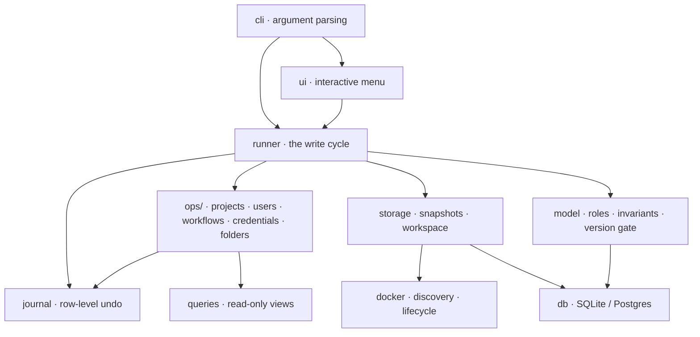

<div align="center">

# ▄▀ n8n-warden

### Access control &amp; maintenance for self-hosted n8n Community Edition

*Team projects · workflow &amp; credential sharing · folders · users · pruning — without the Enterprise licence, straight through the database, safely.*

<br/>


</div>

<br/>

```
  ▄▀ n8n-warden 1.1.0   ·  n8n 2.34.5  ·  sqlite  ·  n8n ● up
  ──────────────────────────────────────────────────────────────

     1  Projects               (6)
     2  Users                  (6)
     3  Workflows              (49)
     4  Credentials            (40)
     5  Folders                (6)
     6  Bulk operations
     7  Audit & inventory
     8  Snapshots & undo
     9  Prune & disk space
    10  Doctor
     0  Quit
```

<br/>

## Why this exists

n8n's Community Edition is generous — unlimited workflows, unlimited executions — but it locks **team collaboration** behind a paid plan. On free CE, only the instance owner and a workflow's creator can see it. There are no team projects, no sharing, no role-based access. For a small team self-hosting n8n, that's the wall you hit first.

**Here's the thing most people don't know:** n8n enforces those limits in two different places, and only one of them is a real gate.

- The **write endpoints and the UI buttons** are licence-gated. Click "Share" on free CE and you get `403 Plan lacks license for this feature`.
- But **permission *resolution* is not gated.** n8n decides who can see a workflow by reading the `shared_workflow` and `project_relation` tables at request time — and that code path has *no licence check in it.*

So a row written directly into those tables is **honoured in full**. The member logs in, sees the team project, opens the workflow, gets real edit/execute/delete scopes. Verified end-to-end on a clean 2.34.5 instance:

<div align="center">

| Action | via n8n's REST API (CE) | via n8n-warden (direct DB) |
|---|:---:|:---:|
| Create team project | ❌ `403 Plan lacks license` | ✅ created &amp; served |
| Share workflow with a project | ❌ `403 Plan lacks license` | ✅ member gets full access |
| Member sees the shared workflow | — | ✅ 8 scopes incl. update/execute/delete |
| An *unrelated* workflow | — | ✅ `404` — authz still enforced |

</div>

n8n-warden writes those rows for you — **and refuses to let you corrupt your database doing it.**

<br/>

## The catch that makes it hard, and why you want a tool

Hand-editing that database is how people brick their n8n. The advice floating around GitHub is written for n8n **1.x** and breaks four ways on 2.x:

<div align="center">

| The old advice | What actually happens on 2.34 |
|---|---|
| `SELECT u.role FROM user` | **Column gone.** It's `roleSlug` now, FK'd to a new `role` table |
| Write any string to `project_relation.role` | **Rejected** — that column has a foreign key |
| Write any string to `shared_workflow.role` | **Silently accepted** — no FK — a typo makes a workflow *nobody* can open |
| `cp database.sqlite backup.sqlite` | **Captures a stale DB** — 2.x runs WAL mode; a third of recent data lives in `-wal` |
| Ignore `parentFolderId` on a move | **Dangling folder** — workflow renders in a folder the new owner can't see |

</div>

n8n-warden enforces the five rules n8n's own code assumes but the schema doesn't:

1. **Roles are read from the live `role` table**, never hardcoded — a typo is caught, not inserted
2. **`PRAGMA foreign_keys=ON`** — SQLite ships this *off*, so even the constraints n8n declares are inert until you turn them on
3. **Ownership is an update, never a second insert** — exactly one `workflow:owner` row, always
4. **Cross-project folders are detected and repaired** on every transfer
5. **Credential co-dependency is checked** — it tells you which credentials the recipient can't see *before* the move, not after their nodes fail

Every write runs in one transaction, re-checks those invariants, and **rolls back if the change would break any of them.**

<br/>

## Safety model

Because it edits a live database, the whole design is built around *never* being the reason you lose data.

```
  snapshot ──▶ stop n8n ──▶ mutate ──▶ verify invariants ──▶ commit ──▶ start ──▶ health-check
                                            │
                                    breaks one? ──▶ roll back, write nothing
```

- **Two independent ways back.** A full DB snapshot before every write batch (`restore`), *and* a row-level undo journal that reverts a batch — and **skips any row that changed since**, so it never clobbers an edit you made in the UI afterwards.
- **WAL-safe writes.** The write-back deletes stale `-wal`/`-shm` and swaps the file in a single step; a leftover WAL replayed over a fresh DB is a classic corruption, and this closes it.
- **Real HTTP health-check**, two stages (`/healthz/readiness` then the editor), because scraping `docker logs` reports the *previous* boot's "ready" line and hides a failed start.
- **Version gate.** It reads n8n's own `migrations` table and warns before writing if your instance has moved past the versions it's verified against.
- **Typed confirmation** for the two operations with unbounded blast radius (`project delete`, `user delete`) — `--yes` deliberately won't skip it.
- **`doctor` + `doctor --fix`** finds and repairs the exact inconsistencies a botched hand-edit leaves behind.
- **91-check self-test** against a synthetic database — run it before you ever point the tool at real data.

<br/>

## Install

Zero dependencies. Python 3.9+ and `docker`, both of which you already have if you run n8n. `bcrypt` is used *if present* (only to set a password) and is never required.

```bash
git clone https://github.com/<you>/n8n-warden.git
cd n8n-warden
./build.sh                    # bundles src/ into a single n8n-warden.pyz
./n8n-warden.pyz doctor       # read-only — verifies it can see your instance
```

`build.sh` uses Python's stdlib `zipapp` — the source stays modular, the artifact is one file you can `scp` to a server.

```bash
scp n8n-warden.pyz you@your-n8n-host:
ssh you@your-n8n-host './n8n-warden.pyz'
```

Prefer not to build? Run from source: `./warden.py doctor`.

<br/>

## Quick start

```bash
./n8n-warden.pyz                    # interactive menu (the screenshot up top)
./n8n-warden.pyz doctor             # health + version + inventory report
```

The three-command version of the whole point — give a teammate a shared workspace:

```bash
# 1. a team project (the REST API refuses this on CE)
./n8n-warden.pyz project create "Ops Team"

# 2. an account for them (creates their personal project too)
./n8n-warden.pyz user create bob@company.com --first Bob

# 3. hand them a folder of workflows — and the credentials to run them
./n8n-warden.pyz folder share COST_REPORT --to bob@company.com --with-credentials
```

Every write command takes `--dry-run` first, showing the exact rows it would touch:

```
$ ./n8n-warden.pyz transfer wf J23uy... --to "Ops Team" --dry-run

  op      table            key
  ──────────────────────────────────────────────────────────
  DELETE  shared_workflow  workflowId=J23uy…, projectId=K7v3…
  INSERT  shared_workflow  workflowId=J23uy…, projectId=30DF…
  UPDATE  workflow_entity  id=J23uyafuyc40IC2O
  · 2 credential(s) not available to the destination: N8N Cost Bot, AWS (IAM) account
  · transferred 'Slack Cost Bot'

  dry run — nothing written
```

<br/>

## What it does

<div align="center">

| Area | Commands |
|---|---|
| **Projects** | `project create · rename · delete · members · add-member · remove-member` |
| **Users** | `user create · delete · set-role · disable · enable · clear-mfa · clear-password` |
| **Workflows** | `transfer · share · unshare` (single or `bulk`) |
| **Credentials** | `transfer · share · unshare` |
| **Folders** | `folder share · unshare · transfer · list · create · rename · delete` |
| **Bulk** | selectors: `wf:tag=prod`, `wf:owner=a@b.com`, `cred:type=slackApi`, … |
| **Audit** | `ls matrix` · `ls orphans` · `export` (who-can-see-what, to JSON) |
| **Maintenance** | `prune` · `doctor` · `doctor --fix` |
| **Recovery** | `history` · `undo` · snapshot restore |

</div>

### Sharing a folder

n8n has no concept of a shared folder — a folder belongs to exactly one project. So `folder share` shares every workflow *inside* it (recursively by default), and `folder transfer` moves the whole subtree to another project. `--with-credentials` brings the credentials those workflows need, so the recipient can actually run them.

### Reclaiming disk

Execution history is typically **99%+** of an n8n database. On the instance this was built against, `prune` took it from **2.4 GB to 273 MB** — and the tool checks foreign-key cascades first, so it won't, say, delete a workflow's publish-audit history as a side effect.

```bash
./n8n-warden.pyz prune --executions 10 --dry-run     # keep the newest 10 runs per workflow
```

### Repairing

```bash
./n8n-warden.pyz doctor              # lists any invariant breaks, each with a stable id
./n8n-warden.pyz doctor --fix all    # repairs the fixable ones, in one undoable batch
```

<br/>

## Architecture

Twenty-seven small modules, dependencies running strictly downward — nothing below `runner` knows a write cycle exists, and every mutation is undoable *by construction* because it records through a batch instead of writing directly.



Read [`ARCHITECTURE.md`](ARCHITECTURE.md) for the full layer map and design notes.

<br/>

## Scope &amp; honesty

**What works, and why.** Projects, sharing, folders, roles — because their licence gate sits on *mutation and UI*, leaving permission resolution open. That's a legitimate seam, not a hack.

**What does *not* work, and why not.** **SSO / SAML / LDAP / OIDC cannot be enabled this way**, and n8n-warden won't pretend otherwise. Those gates sit *in the login path itself*: the auth handlers check the licence on every request, the modules don't even register their routes when unlicensed, and the check is backed by a cryptographically-signed certificate — not a database flag. Verified empirically: writing LDAP config to the DB, n8n overrides `authenticationMethod` back to `email` on boot. Worse, forcing it would **lock every non-owner out of the instance.** If you need SSO on free CE, put an external auth proxy (OAuth2-proxy, Authelia, your IdP) *in front* of n8n instead.

> **Need SSO anyway?** You don't have to defeat anything — put your IdP *in front* of n8n. A ready-to-deploy gateway (Caddy + oauth2-proxy + your IdP, n8n unmodified) lives in [`examples/sso/`](examples/sso/README.md): real SAML/OIDC SSO with MFA on free CE, webhooks still working.

**The line this tool will not cross.** It writes rows through n8n's documented schema. It does **not** patch the n8n binary, forge a licence certificate, or touch any `.ee`-licensed code. That boundary is deliberate and permanent.

**Licensing.** n8n's [Sustainable Use Licence](https://github.com/n8n-io/n8n/blob/master/LICENSE.md) permits internal business use of self-hosted CE. It carves out `.ee` files under a separate Enterprise licence — which this tool never touches. There is **no official n8n position** on managing these tables directly; a targeted search found neither blessing nor prohibition. If that matters for your compliance posture, ask n8n rather than relying on inference. This project is an independent tool, not affiliated with or endorsed by n8n GmbH.

**Upgrade fragility.** These tables are internal implementation details with no stability contract. Verified against n8n **2.32.7 → 2.34.5** (schema identical across both). `doctor` warns when your instance has moved past that range. Re-verify after major upgrades.

<br/>

## FAQ

**Does it need root?** No. It reaches the database through the Docker bind mount (or `docker cp` for named volumes), never the root-only volume path.

**Does it work with Postgres?** It's implemented and auto-detected, but SQLite is the tested path. Postgres is marked experimental for that reason.

**Is my data safe if it crashes mid-write?** Yes. Everything is one transaction; a crash rolls back. And a full snapshot preceded the batch regardless.

**Can I undo?** `./n8n-warden.pyz undo` reverts the last batch, skipping any row you changed since. `prune` is the one exception — a row journal of thousands of executions would exceed the database, so use `--snapshot` there if you want a net.

<br/>

<div align="center">

**[Full manual →](ARCHITECTURE.md)** · Built for teams who self-host and want to stay that way.

<sub>Not affiliated with n8n GmbH. "n8n" is a trademark of its respective owner.</sub>

</div>
