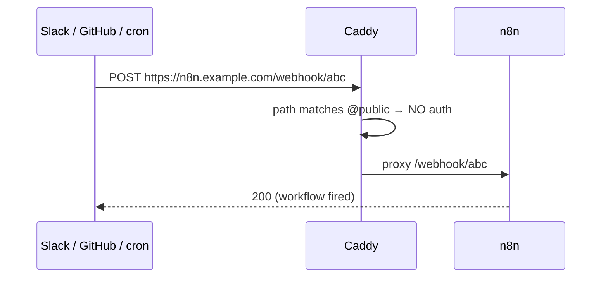

# SSO for self-hosted n8n Community Edition

Organization-wide single sign-on against **your own IdP** — SAML or OIDC, MFA, central deprovisioning — **without buying Enterprise and without touching n8n**.

n8n's *built-in* SSO page is an Enterprise-licensed feature and stays locked; this does not unlock, patch, or circumvent it. Instead it authenticates every user at an **external gateway in front of n8n**, so unauthenticated traffic never reaches the editor. n8n runs completely stock — the image is unmodified, so upgrades are just a tag bump.

> **What this is, honestly.** This reproduces the *user experience and security outcome* of SSO — your IdP is the front door, MFA and deprovisioning live there, nobody sees n8n without authenticating. It is **not** identical to native Enterprise SAML: n8n keeps its own login underneath the gate (one extra click per session), and identities are not automatically mapped into n8n's user model. See [Limitations](#limitations-vs-native-enterprise-saml). For a small team, the gap is a second login screen once per session — for most, an acceptable trade to get real SSO on free CE.

Verified against **n8n 2.34.5** (all bypass paths probed live). Every version-sensitive claim is tagged.

---

## 1. Architecture


One host, one public entry point (Caddy), one auth engine (oauth2-proxy). n8n is on a private compose network — never published to the host, never internet-facing.

---

## 2. Request flow — User → IdP → Gateway → n8n

1. User opens `https://n8n.example.com/`.
2. Caddy matches the gated route, calls `oauth2-proxy /oauth2/auth`.
3. No valid session → oauth2-proxy returns 401 → Caddy redirects the browser to `/oauth2/sign_in`, which bounces to **your IdP**.
4. User authenticates at the IdP (**MFA, conditional access, device policy all enforced here**).
5. IdP redirects back to `/oauth2/callback`; oauth2-proxy validates the token, sets its **session cookie**, redirects to the original URL.
6. Caddy re-runs `/oauth2/auth` → now **2xx** → request is proxied to `n8n:5678`.
7. n8n shows **its own login once** (see [§Double login](#the-double-login-reality)); after that, n8n's session cookie persists for the browser session.

## 3. Webhook flow — External service → n8n



External callers can't do interactive SSO, so trigger paths **bypass the gate entirely**. They remain protected by n8n's own webhook secrecy (unguessable path IDs) and whatever auth the workflow's trigger node enforces (HMAC signatures, header auth, etc.) — not by the IdP.

---

## 4–7. Traffic classes and the path split

The routing decision *is* the security boundary. Verified live on **2.34.5**:

| Class | Paths | Policy | Why |
|---|---|---|---|
| **Browser / UI** | `/`, `/assets/*` | **GATE** | The editor. Humans, interactive. |
| **REST (editor backend)** | `/rest/*` incl. `/rest/login` | **GATE** | Backs the UI; must sit behind the same session. |
| **WebSocket push** | `/rest/push` | **GATE** | Editor live-updates. Caddy upgrades the WS transparently; the auth check runs on the HTTP upgrade request, which carries the cookie. |
| **Webhook execution** | `/webhook/*`, `/webhook-waiting/*` | **BYPASS** | Slack/GitHub/Stripe/Wait-node callbacks. No browser, no SSO. |
| **Webhook (test)** | `/webhook-test/*` | **BYPASS** | Editor "listen for test event" delivery from outside. |
| **Forms** | `/form/*`, `/form-test/*`, `/form-waiting/*` | **BYPASS** | Form Trigger — meant to be filled by the public. |
| **MCP triggers** | `/mcp/*`, `/mcp-test/*` | **BYPASS** | n8n exposed as an MCP tool server; external MCP clients can't SSO. |
| **Health** | `/healthz`, `/healthz/readiness` | **BYPASS** | Docker/LB probes. `/metrics` too if you enable `N8N_METRICS`. |
| **Credential OAuth callback** | `/rest/oauth2-credential/callback`, `/rest/oauth1-credential/callback` | **BYPASS** | n8n's *own* OAuth (e.g. authorizing a Google Sheets credential). The provider redirect can arrive without the session cookie; gating it can break credential setup. |
| **Public API** | `/api/*` | **BYPASS** | Authenticates with `X-N8N-API-KEY`, not cookies. Gating it blocks your scripts/CI. See [§12](#12-api-authentication-strategy). |

**Security implication of each bypass:** a bypassed path is **not** behind your IdP — it's exposed to the internet, guarded only by n8n's own mechanism for that path. Webhooks rely on unguessable IDs + trigger-node auth; forms are intentionally public; the API relies on its key. **The editor and all credential/workflow management stay fully gated**, so a bypass never exposes the ability to read credentials or edit workflows. If a webhook needs stronger protection, add auth *in the workflow* (Header Auth / HMAC verification node), not at the proxy.

---

## 8. Gateway comparison

| Gateway | Speaks | Self-hosted | Best when |
|---|---|:---:|---|
| **oauth2-proxy** *(used here)* | OIDC/OAuth2 | ✅ | Your IdP offers OIDC (Keycloak, Authentik, Entra, Okta, Google). Simplest, single binary, purpose-built for path-gated forward-auth. **Use ≥ 7.11.0** (CVE-2025-54576). |
| **Authentik proxy provider** | OIDC **+ SAML** | ✅ | Your IdP is **SAML-only**. Authentik's outpost consumes SAML upstream and presents forward-auth downstream. Swap it in for oauth2-proxy; wiring is identical, callback path becomes `/outpost.goauthentik.io/*`. |
| **Authelia** | OIDC RP + MFA | ✅ | You want built-in MFA/WebAuthn at the gate itself, or already run it. Clean YAML `access_control` bypass rules. |
| **Traefik ForwardAuth** | delegates | ✅ | Already on Traefik. Adds nothing auth-wise over Caddy; just a different place to declare bypasses. |
| **nginx `auth_request`** | delegates | ✅ | nginx is your standard. Works, but the path-split spreads across more `location` blocks. |
| **Cloudflare Access** | OIDC/SAML | ❌ (SaaS) | You want zero self-hosted auth infra and are fine with Cloudflare in the path. Fastest to stand up; least self-hosted. |

**SAML specifically:** oauth2-proxy does not speak SAML. If your IdP only offers SAML, put **Authentik** (or Keycloak) in the gateway slot as a SAML→forward-auth broker. Prefer OIDC if your IdP offers both — it's simpler and every provider here supports it.

---

## 9–10. Deploy

Prereqs: a DNS record, ports 80+443 open, Docker Compose.

```bash
cd examples/sso
cp .env.example .env
openssl rand -base64 32          # → paste as OAUTH2_PROXY_COOKIE_SECRET
$EDITOR .env                     # set N8N_DOMAIN, OIDC_ISSUER_URL, client id/secret

docker compose up -d
docker compose logs -f caddy     # watch the TLS cert issue
```

### IdP configuration (register n8n as an OIDC client)

In your IdP, create an OIDC/OAuth application:

| Field | Value |
|---|---|
| Redirect / callback URI | `https://n8n.example.com/oauth2/callback` |
| Grant type | Authorization Code |
| Scopes | `openid email profile` (add `groups` to gate on group membership) |
| Client ID / Secret | → `.env` as `OIDC_CLIENT_ID` / `OIDC_CLIENT_SECRET` |

Then restrict *who* gets in, in `oauth2-proxy.cfg`: `email_domains = ["yourcompany.com"]`, or `allowed_groups = ["n8n-users"]` with `oidc_groups_claim = "groups"`.

### DNS
`n8n.example.com` → A/AAAA record to this host's public IP. Caddy needs it resolvable before it can get a cert.

### TLS
Automatic. Caddy fetches and renews a Let's Encrypt cert on first boot (ports 80+443 must reach it). Certs persist in the `caddy_data` volume — **back it up** to avoid re-issuance rate limits on rebuild.

---

## 11. Webhook exceptions — see [§4–7 table](#47-traffic-classes-and-the-path-split). Each bypass and its blast radius is documented there.

## 12. API authentication strategy

`/api/*` uses n8n's own API keys (`X-N8N-API-KEY`), not IdP cookies — so it **bypasses** the gate. Your programmatic callers keep working with their key. Security: API access is only as strong as key hygiene. Harden by (a) issuing keys narrowly, (b) optionally IP-allowlisting `/api/*` at Caddy to your CI/office ranges, (c) rotating keys. If you have *no* API callers, gate `/api/*` too — move it out of `@public` in the Caddyfile.

## 13. WebSocket handling

n8n's editor push is a WebSocket at **`/rest/push`** (default backend on 2.34.5; `N8N_PUSH_BACKEND` can switch to SSE). It's a **gated** path — Caddy's `reverse_proxy` upgrades it transparently, and `forward_auth` validates the cookie on the HTTP upgrade handshake. No extra config. If push ever fails to connect behind the proxy, confirm the upgrade headers aren't being stripped and that the auth cookie is present on `/rest/push`.

## 14. Upgrade strategy

n8n is **unmodified**, so upgrades don't interact with the gateway at all:

```bash
# bump N8N_TAG in .env, then:
docker compose pull n8n && docker compose up -d n8n
```

The gateway (Caddy, oauth2-proxy) upgrades independently on its own cadence — watch oauth2-proxy security releases. Across an n8n **major** (2.x → 3.x), take a data snapshot first and re-run the [testing matrix](#18-testing-matrix), especially webhook paths (the one thing that would change the routing). Because nothing patches n8n, there's no hook to re-verify on each release — the standing weakness of the "trusted-header" auto-login approach this design deliberately avoids.

## 15. Backup / rollback

| Asset | Backup |
|---|---|
| n8n data (workflows, credentials, **encryption key**) | snapshot the `n8n_data` volume / bind dir — or use `n8n-warden`'s snapshot |
| TLS certs | the `caddy_data` volume |
| Config | `.env`, `Caddyfile`, `oauth2-proxy.cfg` (keep `.env` out of git) |

**Rollback to no-SSO** is instant and non-destructive — the gateway never wrote to n8n's data: `docker compose down`, then run n8n directly on 5678 again. Your workflows and users are untouched.

## 16. Security hardening checklist

- [ ] `OAUTH2_PROXY_COOKIE_SECRET` is a fresh `openssl rand -base64 32`, unique per deploy
- [ ] oauth2-proxy image is **≥ 7.11.0** (CVE-2025-54576)
- [ ] Access restricted by `email_domains` **or** `allowed_groups` — not left at `*` in production
- [ ] n8n is **not** published to the host (`expose`, not `ports`) — verify `docker ps` shows no `0.0.0.0:5678`
- [ ] `N8N_SECURE_COOKIE=true` and the whole path is HTTPS
- [ ] `N8N_PROXY_HOPS` matches your real proxy count
- [ ] HSTS + security headers present (in the Caddyfile)
- [ ] Webhook trigger nodes that handle sensitive actions add their own auth (HMAC/header) — bypass ≠ open door, but defense-in-depth
- [ ] `/metrics` not exposed publicly (bypassed only if you enable it; restrict to internal)
- [ ] Backups of `n8n_data` **and** the encryption key verified restorable
- [ ] IdP enforces MFA and has n8n users provisioned/deprovisioned in the right group

## 17. Step-by-step deployment

1. Point DNS `n8n.example.com` at the host; open 80+443.
2. Register the OIDC client in your IdP (callback `https://n8n.example.com/oauth2/callback`).
3. `cp .env.example .env`; fill domain, issuer, client id/secret; generate the cookie secret.
4. `docker compose up -d`; watch `docker compose logs -f caddy` until the cert issues.
5. Browse to `https://n8n.example.com` → you should bounce to the IdP.
6. Authenticate → land on n8n's login → sign in / create the owner once.
7. Run the [testing matrix](#18-testing-matrix).
8. Restrict access (`email_domains`/`allowed_groups`), redeploy oauth2-proxy.
9. Manage per-user n8n accounts and their access with [`n8n-warden`](../../README.md).

## 18. Testing matrix

| # | Test | Expected |
|---|---|---|
| 1 | Unauthenticated UI (`curl -I https://host/`) | 302 → IdP sign-in |
| 2 | Authenticated UI (browser, after IdP) | n8n editor loads |
| 3 | Logout | oauth2-proxy `/oauth2/sign_out` clears gate; n8n logout clears its own cookie (no SLO — see below) |
| 4 | Expired gateway session | next request re-bounces to IdP |
| 5 | Revoked IdP user | IdP refuses; gate denies; user can't reach n8n |
| 6 | Webhook execution (`curl -X POST https://host/webhook/<id>`) | 200, workflow fires — **no** IdP redirect |
| 7 | API request (`curl -H "X-N8N-API-KEY: …" https://host/api/v1/workflows`) | 200 — not gated |
| 8 | WebSocket (open editor, edit a node) | live updates work (`/rest/push` connected) |
| 9 | OAuth credential in a workflow (authorize Google Sheets) | callback completes, credential saved |
| 10 | Container health (`docker inspect n8n`) | healthy; `/healthz` reachable un-gated |
| 11 | n8n upgrade (bump `N8N_TAG`, `up -d`) | comes back healthy; re-run 1, 6, 8 |

---

## The double-login reality

n8n CE has **no supported trusted-header / external-identity hook** (confirmed: no such env var exists in the running 2.34.5). So n8n keeps its own login *under* the gate. Real options:

- **Two logins (this design, recommended).** IdP once (SSO'd across your org), then n8n's own login once per browser session. Zero hacks, survives every upgrade. This is what most production deployments actually ship.
- **Shared n8n account behind the gate.** One n8n login for everyone past the IdP. Loses per-user attribution, ownership, and makes n8n's RBAC meaningless — only for a one/two-person instance. Not real SSO; don't confuse the two.
- **Trusted-header auto-login (a known community hack).** Splices an undocumented `EXTERNAL_HOOK_FILES` middleware into n8n to read a proxy header and call n8n's internal `issueCookie()`. Eliminates the second login *but* depends on n8n internals that have already broken once across versions — budget re-verification on every upgrade, and the proxy **must** strip any client-supplied copy of the trust header or you have an auth bypass. This design deliberately avoids it for a stock, upgrade-safe instance. Documented here so you can make the call, not recommended by default.

**Single logout (SLO):** the gateway cookie and n8n's cookie are independent. "Log out everywhere" means hitting both `/oauth2/sign_out` and n8n's logout; there's no SLO wired between them out of the box.

## Limitations vs native Enterprise SAML

| | This gateway | Native Enterprise SAML |
|---|---|---|
| SSO to reach n8n | ✅ | ✅ |
| MFA / conditional access | ✅ (at IdP) | ✅ (at IdP) |
| Central deprovisioning | ✅ (IdP group) | ✅ |
| Second (n8n) login | ⚠️ once per session | ❌ none |
| IdP identity → n8n user mapping | ❌ manual (via warden) | ✅ automatic |
| SCIM / auto-provisioning | ❌ | ✅ (Enterprise) |
| Cost | free (OSS) | paid licence |
| n8n modified | never | n/a |

For the identity-mapping gap, pair this with [`n8n-warden`](../../README.md): the gateway controls *who gets in*, warden controls *what each account can see* once inside.

---

## The simplest production setup I'd deploy for a small team

**Exactly this repo's default: Caddy → oauth2-proxy (OIDC) → n8n, accepting the one extra n8n login.** It's three containers, one `.env`, automatic TLS, nothing patched, and it upgrades with a tag bump. If your IdP is SAML-only, swap oauth2-proxy for an Authentik outpost and keep everything else. Skip the trusted-header auto-login unless the second click is a genuine dealbreaker — the stock, upgrade-proof instance is worth more than saving one login per session. Manage the n8n accounts behind the gate with `n8n-warden`.
